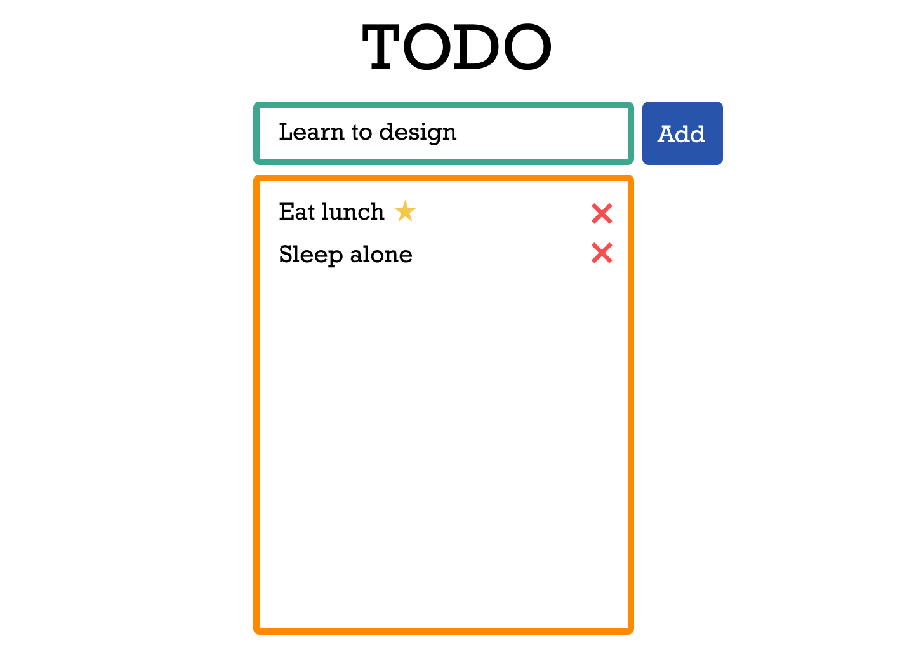
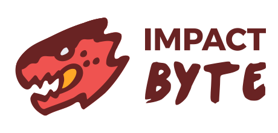

# Todo App by Impact Byte

A simple todo app to save and list various kinds of things to do.


This is a markdown documentation with `.md` format.



## Features

In the app, we can:

- Create todo
- List todo
- Delete todo
- Favorite todos
  - Use a star symbol
    - With yellow color

## Inspirations

- [TodoMVC](http://todomvc.com)
- [Google Keep](https://keep.google.com)
- [Wunderlist](https://www.wunderlist.com)
- [Todoist](https://en.todoist.com)
- [Microsoft Todo](https://todo.microsoft.com)

## Team

[List of team members](./team.md)

## Code

```md
# Heading One

## Heading Two
```

## Credits


